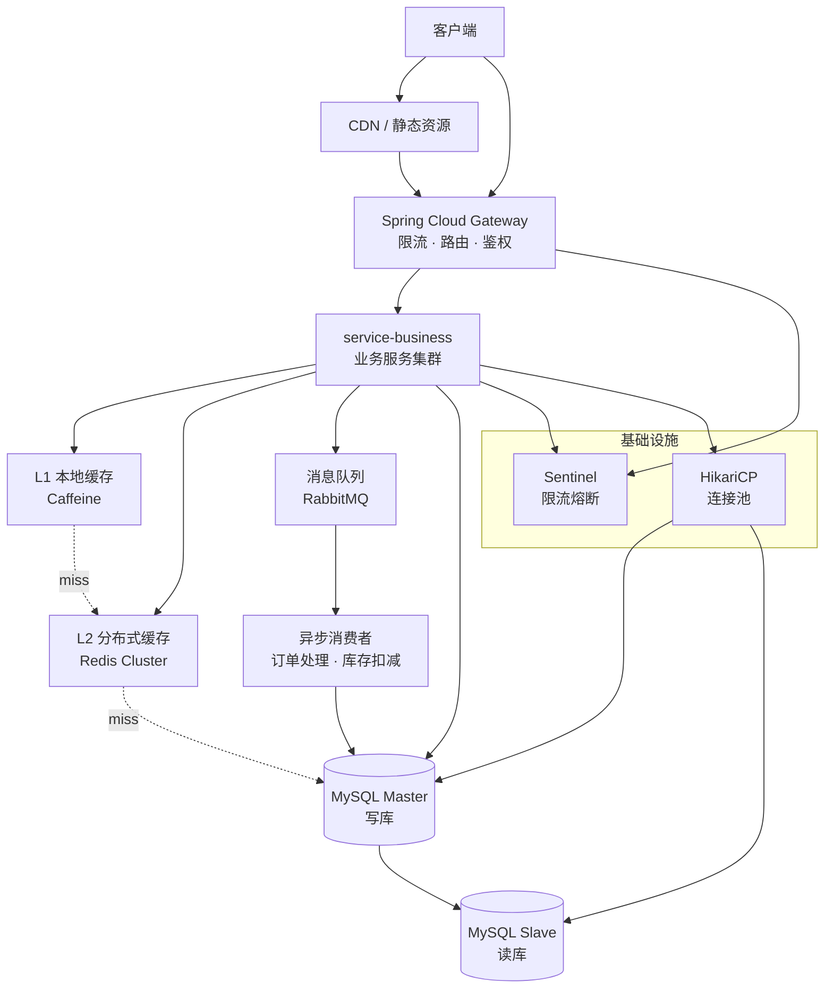
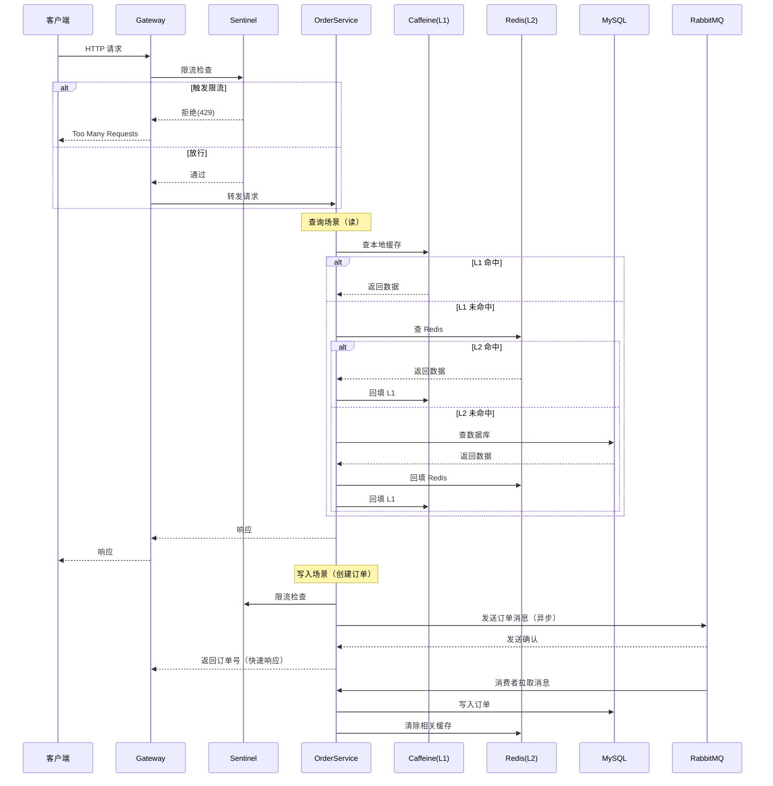

# 设计文档：高并发电商系统模块

## 概述

本设计文档针对现有 Spring Cloud 微服务电商项目，系统性地引入高并发能力增强模块。核心设计思路围绕"分流、缓存、异步、扩展"四大支柱展开，在不破坏现有业务代码结构的前提下，通过多级缓存（Caffeine + Redis）降低数据库压力、消息队列（RabbitMQ）实现异步削峰、Sentinel 限流保护系统稳定性、以及数据库读写分离与连接池优化提升整体吞吐量。

现有项目已具备 Spring Cloud Gateway 网关、订单业务服务（含游标分页、混合分页等深分页优化）、公共工具模块（统一返回结果、订单号生成器）。本次设计将在此基础上，以最小侵入方式为各层引入高并发基础设施，目标是支撑万级 QPS 的订单查询与千级 TPS 的订单创建场景。

技术栈：Java 21、Spring Boot 3.2、Spring Cloud 2023、MyBatis-Plus、Maven 多模块。新增依赖包括 Caffeine、Spring Data Redis、spring-boot-starter-amqp（RabbitMQ）、Sentinel、HikariCP（Spring Boot 默认已集成）。

## 架构

### 整体架构



### 请求处理流程



## 组件与接口

### 组件 1：多级缓存管理器（MultiLevelCacheManager）

**职责**：
- 封装 L1（Caffeine）+ L2（Redis）两级缓存的读写逻辑
- 提供统一的缓存操作接口，业务层无需感知缓存层级
- 处理缓存穿透（空值缓存）、缓存击穿（互斥锁）、缓存雪崩（随机过期时间）

**接口**：
```java
public interface MultiLevelCache<K, V> {

    /**
     * 查询缓存，L1 -> L2 -> dbLoader 逐级降级
     * @param key 缓存键
     * @param dbLoader 数据库回源函数（L1/L2 均未命中时调用）
     * @return 缓存值，可能为 null
     */
    V get(K key, Function<K, V> dbLoader);

    /**
     * 写入缓存（同时写 L1 和 L2）
     */
    void put(K key, V value);

    /**
     * 删除缓存（同时删 L1 和 L2）
     */
    void evict(K key);

    /**
     * 批量删除（支持前缀匹配）
     */
    void evictByPrefix(String prefix);
}
```

### 组件 2：限流组件（RateLimitManager）

**职责**：
- Gateway 层全局限流（基于路由的 QPS 限制）
- Service 层接口级限流（基于 Sentinel 注解）
- 支持热点参数限流（如按 userId 限流防刷）

**接口**：
```java
public interface RateLimitManager {

    /**
     * 检查是否允许通过
     * @param resource 资源标识（如接口路径）
     * @param count 请求数量
     * @return true=放行, false=限流
     */
    boolean tryAcquire(String resource, int count);

    /**
     * 热点参数限流
     * @param resource 资源标识
     * @param param 热点参数值（如 userId）
     */
    boolean tryAcquireWithParam(String resource, Object param);
}
```

### 组件 3：消息队列生产者/消费者（OrderMessageProducer / OrderMessageConsumer）

**职责**：
- 将订单创建等写操作异步化，削峰填谷
- 基于 RabbitMQ 的 Publisher Confirms 保证消息可靠投递，结合本地消息表兜底
- 消费端幂等处理，防止重复消费
- 利用 RabbitMQ 死信队列（DLX）实现延迟消息与失败消息处理

**接口**：
```java
public interface OrderMessageProducer {

    /**
     * 异步发送订单创建消息到 RabbitMQ
     * 使用 RabbitTemplate 发送到 order.exchange，routingKey = order.create
     * @param orderMessage 订单消息体
     */
    void sendOrderCreate(OrderMessage orderMessage);

    /**
     * 发送延迟消息（如订单超时取消）
     * 利用 RabbitMQ 死信队列（DLX）+ TTL 实现延迟投递
     * @param orderMessage 订单消息体
     * @param delayMillis 延迟毫秒数
     */
    void sendOrderDelay(OrderMessage orderMessage, long delayMillis);
}

public interface OrderMessageConsumer {

    /**
     * 监听订单创建队列，消费订单创建消息（幂等处理）
     * @RabbitListener(queues = "order.create.queue")
     */
    void onOrderCreate(OrderMessage message);

    /**
     * 监听订单超时队列，消费订单超时取消消息
     * @RabbitListener(queues = "order.timeout.queue")
     */
    void onOrderTimeout(OrderMessage message);
}
```

### 组件 4：数据库优化层（读写分离 + 连接池）

**职责**：
- 基于 AbstractRoutingDataSource 实现读写分离
- 通过自定义注解 `@ReadOnly` 标记只读方法，自动路由到从库
- HikariCP 连接池参数调优

**接口**：
```java
/**
 * 只读注解，标记在 Service 方法上，自动路由到从库
 */
@Target(ElementType.METHOD)
@Retention(RetentionPolicy.RUNTIME)
public @interface ReadOnly {
}

/**
 * 动态数据源路由
 */
public class DynamicDataSource extends AbstractRoutingDataSource {
    @Override
    protected Object determineCurrentLookupKey();
}
```

## 数据模型

### 订单消息体（OrderMessage）

```java
@Data
public class OrderMessage implements Serializable {
    /** 消息唯一ID（用于幂等） */
    private String messageId;
    /** 订单号 */
    private String orderNo;
    /** 用户ID */
    private Long userId;
    /** 商品ID */
    private Long productId;
    /** 店铺ID */
    private Long shopId;
    /** 订单金额 */
    private BigDecimal amount;
    /** 数量 */
    private Integer quantity;
    /** 消息类型：CREATE / CANCEL / TIMEOUT */
    private String messageType;
    /** 创建时间戳 */
    private Long timestamp;
}
```

**校验规则**：
- `messageId` 非空，全局唯一（UUID）
- `orderNo` 非空，符合 22 位订单号格式
- `userId`、`productId`、`shopId` 大于 0
- `amount` 大于 0
- `quantity` 大于 0 且不超过库存上限

### 缓存键设计

```java
public final class CacheKeys {
    /** 订单详情缓存：order:detail:{orderNo} */
    public static String orderDetail(String orderNo) {
        return "order:detail:" + orderNo;
    }

    /** 用户订单列表缓存：order:user:{userId}:page:{pageNo} */
    public static String userOrderPage(Long userId, int pageNo) {
        return "order:user:" + userId + ":page:" + pageNo;
    }

    /** 商品库存缓存：product:stock:{productId} */
    public static String productStock(Long productId) {
        return "product:stock:" + productId;
    }
}
```

### 限流规则配置模型

```java
@Data
public class RateLimitRule {
    /** 资源名称（接口路径） */
    private String resource;
    /** QPS 阈值 */
    private int threshold;
    /** 限流策略：REJECT / WARM_UP / RATE_LIMITER */
    private String strategy;
    /** 热点参数索引（-1 表示不启用热点限流） */
    private int paramIndex = -1;
}
```


## 关键函数与形式化规约

### 函数 1：MultiLevelCacheManager.get()

```java
public <V> V get(String key, Function<String, V> dbLoader) {
    // L1 查询
    V value = caffeineCache.getIfPresent(key);
    if (value != null) return value;

    // L2 查询
    value = redisTemplate.opsForValue().get(key);
    if (value != null) {
        caffeineCache.put(key, value);  // 回填 L1
        return value;
    }

    // 数据库回源（互斥锁防击穿）
    String lockKey = "lock:" + key;
    try {
        if (redisLock.tryLock(lockKey, 3, TimeUnit.SECONDS)) {
            // 双重检查
            value = redisTemplate.opsForValue().get(key);
            if (value != null) {
                caffeineCache.put(key, value);
                return value;
            }
            value = dbLoader.apply(key);
            if (value != null) {
                // 随机过期时间防雪崩
                long ttl = BASE_TTL + ThreadLocalRandom.current().nextLong(RANDOM_TTL_RANGE);
                redisTemplate.opsForValue().set(key, value, ttl, TimeUnit.SECONDS);
                caffeineCache.put(key, value);
            } else {
                // 空值缓存防穿透（短过期）
                redisTemplate.opsForValue().set(key, NULL_PLACEHOLDER, 60, TimeUnit.SECONDS);
            }
        }
    } finally {
        redisLock.unlock(lockKey);
    }
    return value;
}
```

**前置条件**：
- `key` 非空
- `dbLoader` 非空
- Redis 连接可用
- Caffeine 缓存实例已初始化

**后置条件**：
- 若数据存在：返回值非 null，且 L1、L2 均已缓存该值
- 若数据不存在：返回 null，L2 中写入空值占位符（60s 过期）
- 并发场景下，同一 key 仅有一个线程执行 dbLoader（互斥锁保证）

**循环不变量**：无循环结构

### 函数 2：OrderMessageConsumer.onOrderCreate()（幂等消费）

```java
public void onOrderCreate(OrderMessage message) {
    // 幂等检查：基于 messageId 去重
    String deduplicateKey = "mq:dedup:" + message.getMessageId();
    Boolean isNew = redisTemplate.opsForValue()
            .setIfAbsent(deduplicateKey, "1", 24, TimeUnit.HOURS);

    if (Boolean.FALSE.equals(isNew)) {
        log.info("重复消息，跳过: {}", message.getMessageId());
        return;
    }

    try {
        // 创建订单
        Order order = buildOrder(message);
        orderMapper.insert(order);

        // 扣减库存（Redis 原子操作）
        Long stock = redisTemplate.opsForValue()
                .decrement(CacheKeys.productStock(message.getProductId()));
        if (stock != null && stock < 0) {
            // 库存不足，回滚
            redisTemplate.opsForValue()
                    .increment(CacheKeys.productStock(message.getProductId()));
            throw new BusinessException("库存不足");
        }

        // 清除相关缓存
        cacheManager.evictByPrefix("order:user:" + message.getUserId());
    } catch (Exception e) {
        // 消费失败，删除去重标记，允许重试
        redisTemplate.delete(deduplicateKey);
        throw e;
    }
}
```

**前置条件**：
- `message` 非空，且 `messageId`、`orderNo`、`userId` 等必填字段已校验
- Redis 连接可用
- 数据库连接可用

**后置条件**：
- 成功：订单已写入数据库，库存已扣减，相关缓存已清除，去重标记已设置（24h）
- 失败：数据库无脏数据，去重标记已删除（允许消息重试），库存已回滚
- 幂等性：同一 messageId 的消息仅处理一次

**循环不变量**：无循环结构

### 函数 3：DynamicDataSource 读写分离路由

```java
public class DynamicDataSource extends AbstractRoutingDataSource {

    private static final ThreadLocal<DataSourceType> CONTEXT = new ThreadLocal<>();

    @Override
    protected Object determineCurrentLookupKey() {
        DataSourceType type = CONTEXT.get();
        return type != null ? type : DataSourceType.MASTER;
    }

    public static void setReadOnly() {
        CONTEXT.set(DataSourceType.SLAVE);
    }

    public static void setReadWrite() {
        CONTEXT.set(DataSourceType.MASTER);
    }

    public static void clear() {
        CONTEXT.remove();
    }
}
```

**前置条件**：
- Master 和 Slave 数据源均已正确配置并注册
- ThreadLocal 上下文在请求开始时已正确设置

**后置条件**：
- 标记 `@ReadOnly` 的方法路由到 Slave 数据源
- 未标记的方法默认路由到 Master 数据源
- 请求结束后 ThreadLocal 已清理（防止内存泄漏）

**循环不变量**：无循环结构

### 函数 4：Gateway 限流过滤器

```java
@Component
public class RateLimitGatewayFilter implements GlobalFilter, Ordered {

    @Override
    public Mono<Void> filter(ServerWebExchange exchange, GatewayFilterChain chain) {
        String path = exchange.getRequest().getPath().value();
        String resource = "gateway:" + path;

        if (!SphU.entry(resource)) {
            exchange.getResponse().setStatusCode(HttpStatus.TOO_MANY_REQUESTS);
            return exchange.getResponse().setComplete();
        }

        return chain.filter(exchange);
    }

    @Override
    public int getOrder() {
        return -1; // 最高优先级
    }
}
```

**前置条件**：
- Sentinel 规则已加载
- Gateway 过滤器链已正确注册

**后置条件**：
- 超过 QPS 阈值的请求返回 429 状态码
- 未超限的请求正常转发到下游服务
- 限流统计数据已更新

**循环不变量**：无循环结构

## 算法伪代码

### 多级缓存查询算法

```pascal
ALGORITHM MultiLevelCacheGet(key, dbLoader)
INPUT: key 缓存键, dbLoader 数据库回源函数
OUTPUT: value 缓存值或 null

BEGIN
  ASSERT key ≠ null AND dbLoader ≠ null

  // 第一级：本地缓存
  value ← CaffeineCache.get(key)
  IF value ≠ null THEN
    RETURN value
  END IF

  // 第二级：分布式缓存
  value ← Redis.get(key)
  IF value ≠ null AND value ≠ NULL_PLACEHOLDER THEN
    CaffeineCache.put(key, value)
    RETURN value
  END IF
  IF value = NULL_PLACEHOLDER THEN
    RETURN null
  END IF

  // 第三级：数据库回源（互斥锁防击穿）
  lockKey ← "lock:" + key
  IF Redis.tryLock(lockKey, 3s) THEN
    TRY
      // 双重检查
      value ← Redis.get(key)
      IF value ≠ null THEN
        CaffeineCache.put(key, value)
        RETURN value
      END IF

      value ← dbLoader(key)
      IF value ≠ null THEN
        ttl ← BASE_TTL + Random(0, RANDOM_RANGE)
        Redis.set(key, value, ttl)
        CaffeineCache.put(key, value)
      ELSE
        Redis.set(key, NULL_PLACEHOLDER, 60s)
      END IF
    FINALLY
      Redis.unlock(lockKey)
    END TRY
  END IF

  RETURN value
END
```

### 订单异步创建算法

```pascal
ALGORITHM AsyncOrderCreate(orderRequest)
INPUT: orderRequest 订单创建请求
OUTPUT: orderNo 订单号

BEGIN
  ASSERT orderRequest ≠ null
  ASSERT orderRequest.userId > 0
  ASSERT orderRequest.productId > 0

  // 1. 前置校验（同步）
  IF NOT validateRequest(orderRequest) THEN
    THROW ValidationException
  END IF

  // 2. 预检库存（Redis 原子操作，快速失败）
  stock ← Redis.get(CacheKeys.productStock(orderRequest.productId))
  IF stock ≤ 0 THEN
    THROW BusinessException("库存不足")
  END IF

  // 3. 生成订单号
  orderNo ← OrderNoGenerator.generate(orderRequest.userId)

  // 4. 构建消息
  message ← NEW OrderMessage
  message.messageId ← UUID.randomUUID()
  message.orderNo ← orderNo
  message.userId ← orderRequest.userId
  message.productId ← orderRequest.productId
  message.amount ← orderRequest.amount
  message.quantity ← orderRequest.quantity
  message.messageType ← "CREATE"
  message.timestamp ← System.currentTimeMillis()

  // 5. 发送到 RabbitMQ（异步）
  result ← RabbitTemplate.convertAndSend("order.exchange", "order.create", message)
  IF result.status ≠ SUCCESS THEN
    THROW MQException("消息发送失败")
  END IF

  // 6. 快速返回订单号
  RETURN orderNo
END
```

### 幂等消费算法

```pascal
ALGORITHM IdempotentConsume(message)
INPUT: message 订单消息
OUTPUT: void

BEGIN
  ASSERT message ≠ null
  ASSERT message.messageId ≠ null

  // 1. 幂等检查
  deduplicateKey ← "mq:dedup:" + message.messageId
  isNew ← Redis.setIfAbsent(deduplicateKey, "1", 24h)
  IF NOT isNew THEN
    LOG "重复消息，跳过: " + message.messageId
    RETURN
  END IF

  TRY
    // 2. 创建订单记录
    order ← buildOrder(message)
    DB.insert(order)

    // 3. 扣减库存（原子操作）
    remainStock ← Redis.decrement(CacheKeys.productStock(message.productId))
    IF remainStock < 0 THEN
      Redis.increment(CacheKeys.productStock(message.productId))
      THROW BusinessException("库存不足")
    END IF

    // 4. 清除相关缓存
    Cache.evictByPrefix("order:user:" + message.userId)

  CATCH Exception e
    // 消费失败，删除去重标记允许重试
    Redis.delete(deduplicateKey)
    THROW e
  END TRY
END
```

## 示例用法

### 多级缓存使用示例

```java
@Service
public class OrderService {

    private final MultiLevelCache<String, OrderDetailDTO> orderCache;
    private final OrderMapper orderMapper;

    // 查询订单详情（走多级缓存）
    public OrderDetailDTO getOrderDetail(String orderNo) {
        return orderCache.get(
            CacheKeys.orderDetail(orderNo),
            key -> orderMapper.selectByOrderNo(orderNo)
        );
    }

    // 创建订单后清除缓存
    public void afterOrderCreate(Order order) {
        orderCache.evict(CacheKeys.orderDetail(order.getOrderNo()));
        orderCache.evictByPrefix("order:user:" + order.getUserId());
    }
}
```

### 限流注解使用示例

```java
@RestController
@RequestMapping("/order")
public class OrderController {

    // 接口级限流：QPS = 1000
    @SentinelResource(value = "order-query", blockHandler = "queryBlockHandler")
    @GetMapping("/page")
    public R<CursorPageResult<OrderDetailDTO>> page(CursorPageRequest request) {
        return R.ok(orderService.queryOrderPage(request));
    }

    // 热点参数限流：单用户 QPS = 10
    @SentinelResource(value = "order-create",
            blockHandler = "createBlockHandler",
            fallback = "createFallback")
    @PostMapping("/create")
    public R<String> create(@RequestBody OrderCreateRequest request) {
        String orderNo = orderService.asyncCreateOrder(request);
        return R.ok(orderNo);
    }

    // 限流降级处理
    public R<CursorPageResult<OrderDetailDTO>> queryBlockHandler(
            CursorPageRequest request, BlockException ex) {
        return R.fail("系统繁忙，请稍后重试");
    }
}
```

### 读写分离使用示例

```java
@Service
public class OrderService {

    @ReadOnly  // 自动路由到从库
    public CursorPageResult<OrderDetailDTO> queryOrderPage(CursorPageRequest request) {
        // 查询逻辑不变，底层自动走从库
        return ...;
    }

    // 未标注 @ReadOnly，默认走主库
    public void createOrder(Order order) {
        orderMapper.insert(order);
    }
}
```

### 异步订单创建示例

```java
@RestController
@RequestMapping("/order")
public class OrderController {

    private final OrderMessageProducer producer;

    @PostMapping("/create")
    public R<String> create(@RequestBody OrderCreateRequest request) {
        // 1. 参数校验
        validateRequest(request);

        // 2. 生成订单号
        String orderNo = OrderNoGenerator.generate(request.getUserId());

        // 3. 发送到 RabbitMQ（异步处理）
        OrderMessage message = OrderMessage.builder()
                .messageId(UUID.randomUUID().toString())
                .orderNo(orderNo)
                .userId(request.getUserId())
                .productId(request.getProductId())
                .amount(request.getAmount())
                .quantity(request.getQuantity())
                .messageType("CREATE")
                .timestamp(System.currentTimeMillis())
                .build();

        producer.sendOrderCreate(message);

        // 4. 快速返回订单号（实际订单由 RabbitMQ 消费者异步创建）
        return R.ok(orderNo);
    }
}
```

## 正确性属性

以下属性以全称量化形式描述系统必须满足的不变量：

1. **缓存一致性**：∀ key, 若 DB 中数据被修改，则 L1 和 L2 中对应缓存必须在 TTL 内失效或被主动清除
2. **缓存穿透防护**：∀ key, 若 DB 中不存在该数据，则 L2 中写入空值占位符（TTL=60s），后续相同请求不会穿透到 DB
3. **缓存击穿防护**：∀ 热点 key 过期瞬间，仅有一个线程执行 DB 回源，其余线程等待或返回旧值
4. **消息幂等性**：∀ messageId, 同一消息被消费 N 次（N≥1），数据库中仅产生一条订单记录
5. **限流有效性**：∀ resource, 在任意 1 秒窗口内，通过的请求数 ≤ 配置的 QPS 阈值
6. **读写分离正确性**：∀ 标记 @ReadOnly 的方法，其 SQL 查询路由到 Slave 数据源；∀ 写操作，路由到 Master 数据源
7. **库存一致性**：∀ 订单创建，Redis 库存扣减与数据库订单写入保持最终一致；库存不足时订单创建失败且库存已回滚
8. **订单号唯一性**：∀ 并发请求，OrderNoGenerator 生成的订单号全局唯一（基于时间戳 + 机器ID + 序列号 + 随机数）
9. **连接池健康**：∀ 时刻，HikariCP 活跃连接数 ≤ maximumPoolSize，且无连接泄漏（leakDetectionThreshold 检测）
10. **ThreadLocal 清理**：∀ 请求结束，DynamicDataSource 的 ThreadLocal 上下文已清理，无内存泄漏

## 错误处理

### 场景 1：Redis 不可用

**触发条件**：Redis 连接超时或集群故障
**处理方式**：降级为直接查询数据库，跳过 L2 缓存层；限流降级为本地 Guava RateLimiter
**恢复策略**：Redis 恢复后自动重连，缓存逐步预热

### 场景 2：消息队列发送失败

**触发条件**：RabbitMQ Broker 不可用或网络异常
**处理方式**：写入本地消息表（MySQL），由定时任务补偿重发；利用 RabbitMQ Publisher Confirms 回调检测发送失败
**恢复策略**：RabbitMQ 恢复后，定时任务扫描未发送消息并重新投递

### 场景 3：消费端处理失败

**触发条件**：数据库写入异常、库存不足等
**处理方式**：删除幂等去重标记，消息通过 RabbitMQ 的 basicNack 重新入队重试（最多 3 次）；超过重试次数由死信交换机（DLX）路由到死信队列
**恢复策略**：人工介入处理死信队列消息

### 场景 4：数据库主从延迟

**触发条件**：主从复制延迟导致读到旧数据
**处理方式**：关键业务查询（如刚创建的订单查询）强制走主库；通过 `@Master` 注解覆盖 `@ReadOnly`
**恢复策略**：监控主从延迟指标，延迟超过阈值时自动切换所有读请求到主库

### 场景 5：缓存雪崩

**触发条件**：大量缓存同时过期
**处理方式**：缓存 TTL 加随机偏移量（BASE_TTL + Random）；热点数据永不过期 + 异步刷新
**恢复策略**：Sentinel 限流兜底，防止数据库被打垮

## 测试策略

### 单元测试

- 多级缓存：验证 L1 命中、L2 命中、DB 回源三种路径的正确性
- 幂等消费：验证重复 messageId 仅处理一次
- 读写分离：验证 `@ReadOnly` 注解正确路由到 Slave
- 订单号生成：验证并发场景下的唯一性
- 限流组件：验证 QPS 超限时正确拒绝

### 属性测试

**测试库**：jqwik（Java Property-Based Testing）

- 缓存一致性属性：随机生成 key-value 对，验证写入后读取一致
- 幂等性属性：随机生成消息并重复消费 N 次，验证数据库仅有一条记录
- 订单号唯一性属性：并发生成 10 万个订单号，验证无重复
- 限流属性：在 1 秒窗口内发送 N 个请求（N > threshold），验证通过数 ≤ threshold

### 集成测试

- 端到端订单创建流程：客户端 → Gateway → 限流 → RabbitMQ → 消费者 → DB
- 缓存穿透/击穿/雪崩场景模拟
- 主从切换场景下的数据一致性
- RabbitMQ 故障时的本地消息表补偿机制

### 压力测试

- 使用 JMeter / Gatling 模拟万级 QPS 查询场景
- 验证多级缓存命中率 > 95%
- 验证限流生效后系统稳定性
- 验证 RabbitMQ 削峰后数据库写入 TPS 平稳

## 性能考量

| 指标 | 目标值 | 优化手段 |
|------|--------|----------|
| 订单查询 QPS | ≥ 10,000 | 多级缓存（L1 命中 ~1ms，L2 命中 ~5ms） |
| 订单创建 TPS | ≥ 2,000 | RabbitMQ 异步 + 批量写入 |
| 缓存命中率 | ≥ 95% | 热点数据预加载 + 合理 TTL |
| P99 响应时间 | ≤ 50ms（查询）/ ≤ 100ms（创建） | 本地缓存 + 异步化 |
| 数据库连接数 | ≤ 50（单实例） | HikariCP 调优 |
| GC 停顿 | ≤ 10ms（P99） | G1/ZGC + 堆大小调优 |

### HikariCP 推荐配置

```yaml
spring:
  datasource:
    hikari:
      maximum-pool-size: 20
      minimum-idle: 5
      idle-timeout: 300000
      max-lifetime: 1800000
      connection-timeout: 3000
      leak-detection-threshold: 60000
```

### JVM 推荐参数

```bash
-Xms4g -Xmx4g
-XX:+UseZGC
-XX:MaxGCPauseMillis=10
-XX:+HeapDumpOnOutOfMemoryError
-XX:HeapDumpPath=/tmp/heapdump.hprof
```

## 安全考量

- **限流防刷**：热点参数限流防止单用户恶意刷接口
- **缓存键安全**：缓存键不包含敏感信息，避免通过 Redis 泄露用户数据
- **消息加密**：RabbitMQ 消息中的敏感字段（如金额）建议加密传输
- **SQL 注入防护**：MyBatis 参数化查询，禁止拼接 SQL
- **连接池安全**：数据库密码使用 Jasypt 加密存储，不明文写入配置文件

## 依赖

### 新增 Maven 依赖

| 依赖 | 用途 | 版本建议 |
|------|------|----------|
| `com.github.ben-manes.caffeine:caffeine` | L1 本地缓存 | 3.1.x |
| `org.springframework.boot:spring-boot-starter-data-redis` | L2 分布式缓存 | 跟随 Spring Boot |
| `org.springframework.boot:spring-boot-starter-amqp` | 消息队列（RabbitMQ） | 跟随 Spring Boot |
| `com.alibaba.cloud:spring-cloud-starter-alibaba-sentinel` | 限流熔断 | 2023.x |
| `org.apache.shardingsphere:shardingsphere-jdbc` | 读写分离/分库分表 | 5.4.x |
| `net.jqwik:jqwik` | 属性测试 | 1.8.x |

### 基础设施依赖

| 组件 | 用途 | 部署建议 |
|------|------|----------|
| Redis Cluster | 分布式缓存 + 分布式锁 | 3 主 3 从 |
| RabbitMQ | 消息队列 | 3 节点镜像集群（推荐 Quorum Queue） |
| MySQL 主从 | 读写分离 | 1 主 2 从 |
| Sentinel Dashboard | 限流规则管理 | 单节点 |
